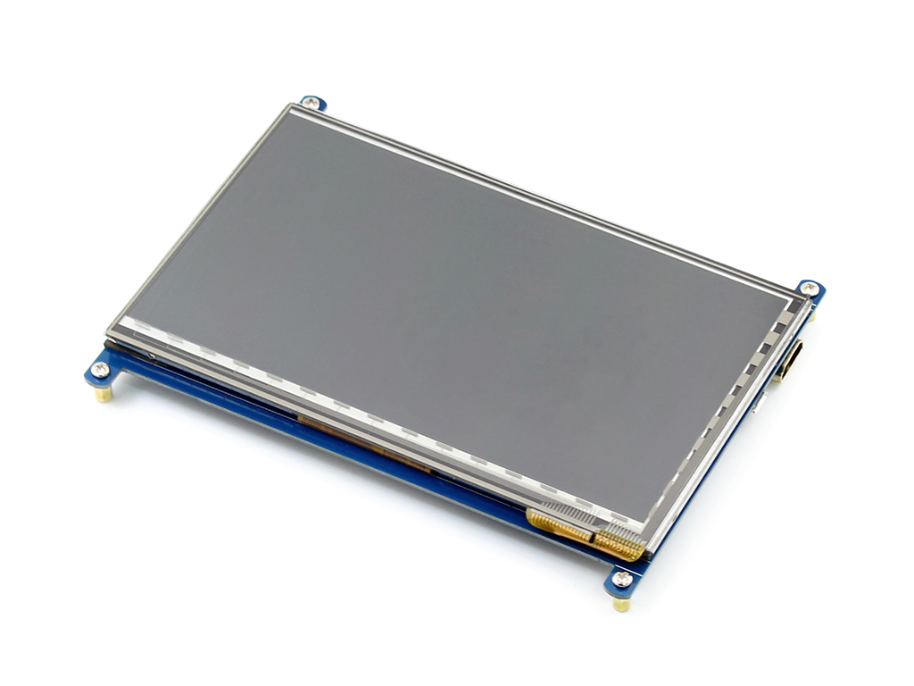
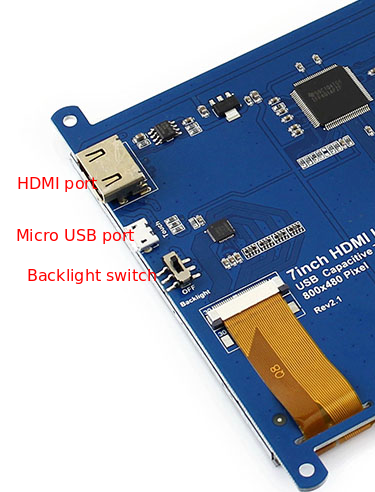
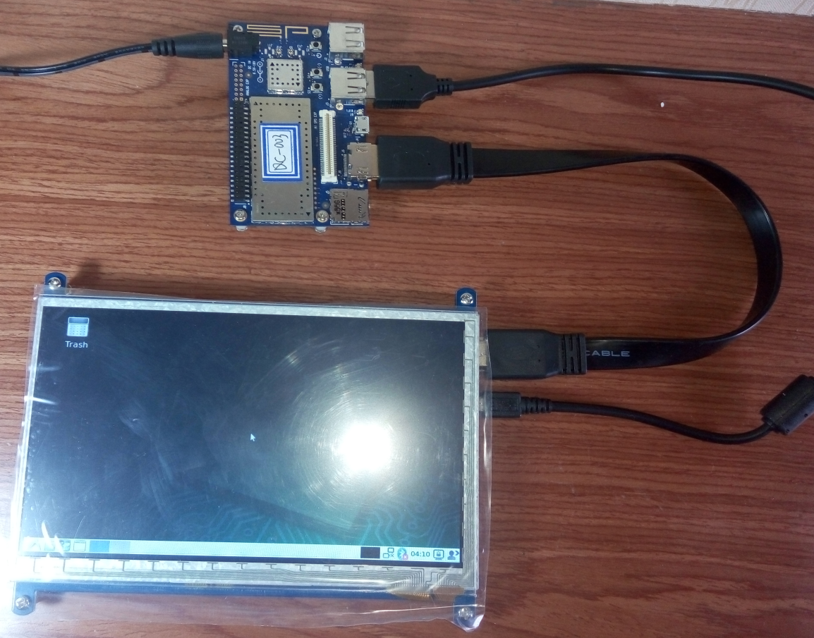

# 7inch HDMI Touch Screen for 96Boards


This is 7inch capacitive touch screen LCD with HDMI interface.The LCD uses standard HID protocol, so it is very easy to be integrated into Linux system , and it especially supports Debian system on 96Boards DB410C.

## Features
* 800×480 high resolution
* Capacitive touch control
* Supports 96Boards DB410C, comes with Debian images
* Supports Raspberry Pi
* Supports Banana Pi / Banana Pro, comes with Lubuntu, Raspbian images
* Supports BB Black, comes with Angstrom image
* For other mini-PCs, driver is required and should be developed by users
* Not only for mini-PCs, it can work as a computer monitor just like any other general HDMI screen
* HDMI interface for displaying, USB interface for touch control
* Back light control to lower power consumption

## Pack list
* 7inch HDMI LCD Touch Screen, 800×480 high resolution()
* HDMI cable x 1
* USB type A plug to micro B plug cable x 1
* Screws pack (4pcs) x 1
* 8G SD card comes with system image x 2

## How to use with DragonBoard 410C

### Prapare SD Card
#### Step 1: Place a microSD Card into the Host PC
The microSD Card must be a minimum of 4 GB and will be erased, so make sure no valuable files you wish to retain are on the microSD Card.

#### Step 2: Download desired SD Card Image
Click on the link below to begin download of the latest SD-Card install image:

* [Debian SD Card Install image](http://builds.96boards.org/releases/dragonboard410c/linaro/debian/latest/dragonboard410c_sdcard_install_debian*.zip)

#### Step 3: Unzip the image file and write onto SD card

**Linux instructions**
```bash
# cd to the directory the install file was extracted to
cd <extraction directory>

sudo dd if=db410c_sd_install_YYY.img of=/dev/XXX bs=4M oflag=sync status=noxfer
```
**Note:**
* YYY can be Debian
* where XXX is the device name

**Windows instructions**
* Download the [Win32DiskImager tool](http://sourceforge.net/projects/win32diskimager/)
* Open the tool, and click the folder icon to select the appropriate img


* Attach your micro SD card (through a USB SD card-reader, if necessary).
* Select "write." There may be a warning about corrupting the device. Click "Yes" to proceed. 


* It should show the following image upon successful completion:


### Flashing the SD Card Image to the DB410c
Once the image is written on the SD Card per the previous section, perform the following steps to flash the image into the eMMC memory on the DragonBoard™ 410c:

* remove the microSD card from the host PC
* remove the power connector from the DB410c and insert the micro SD card into the DB410c
* set the **S6** switch on the DB410c to: **0-1-0-0** {**SD Boot switch** set to “ON”}
* plug a USB keyboard or mouse into either of the two USB connectors on the DB410c Note: If no mouse is used, the keys in the parenthesis on the installer screen can be used to initiate install commands. For example “Install(i)” would be the “i” key on the keyboard. Arrow keys may also be used during the command initiation sequences.

* connect the **Display interface** on the LCD to the DB410c with the HDMI cable


* connect the **USB Touch interface** on the LCD to the USB interface on the DB410C with a type-A-to-micro USB cable.
* turn on the**Backlight switch** on LCD
* connect the power cable to the DB410c
* After system enter into desktop, **disconnect the usb cable and reconnect again**, the touch function of LCD will be actived.



####Note
* Before powering up the DB410C, you should connect it to a LCD properly.
* If the touch funcion can not be used, reconnect the usb cable connected with DB410c and LCD.


### Ref
[Dragonboard 410c Installation Guide for Linux and Android](https://github.com/96boards/documentation/wiki/Dragonboard-410c-Installation-Guide-for-Linux-and-Android)
