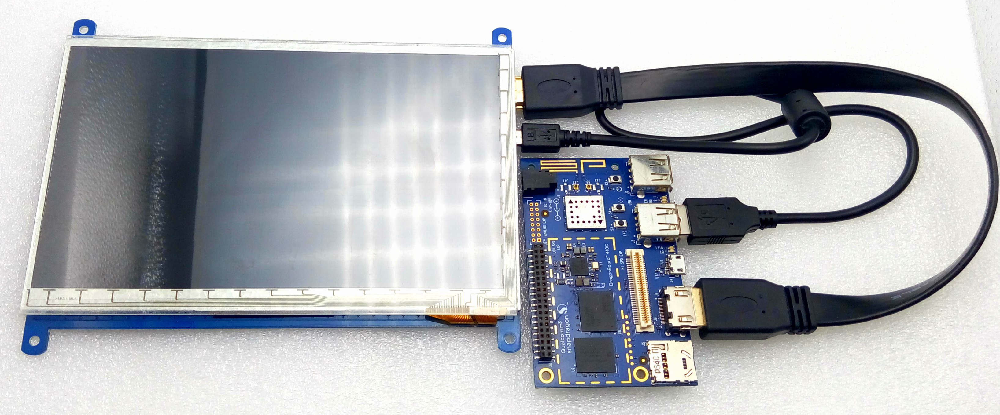

# 7 Inch HDMI Touch Screen User Manual

## 1. Packing list
* 7 Inch HDMI LCD Touch Screen, 800×480 high resolution
* HDMI cable x 1
* USB type A plug to micro B plug cable x 1
* Screws pack (4pcs) x 1
* SD card come with system image x 2

## 2. Getting started with 96Boards DB410C

First, make sure you have installed Debian system on DB 410C board, if you haven't, please read the document on the following website: http://goo.gl/MQCbqH

* Connect the **Display interface** on the LCD to the DB410c with the HDMI cable
* Connect the **USB Touch interface** on the LCD to the USB interface on the DB410C with a type-A-to-micro USB cable.
* Turn on the **Backlight switch** on LCD

* Connect the power cable to the DB410c
* After system enters into desktop, **disconnect the usb cable and reconnect again**, the touch function of LCD will be activated.

## 3. Attention
* Before powering up the DB410C, you should connect it to a LCD properly.
* If the touch function can not be used, reconnect the USB cable between DB410c and LCD.
