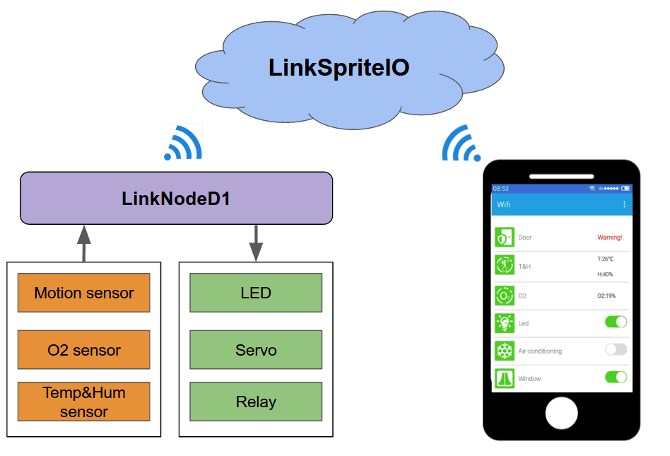

# Open Source Home Automation System

## Introduction
Home automation is the residential extention of building automation and involes the control and automation of lighting, heating, air conditioning, appliances and security. There are many products using Ethernet, RS-485, ZigBee and Z-Wave as communication protocols.

We has developed an open source home automation system which is based on a very cheap $10 WiFi development board LinkNode D1. It is Arduino-compatible WiFi board and is very easy to program.


This system use several sensors including motion sensor, O2 sensor and temperature&humidity sensor to perceive the environment in your home,on the other hand, it is connected to LED, servo and replay to control home appliances. The most important thing is that the system and App are all connected to LinkSpriteIO IoT cloud server which supports REST API and HTTP/websocket communication ,and it enables the home appliances to be controlled online via Internet.
 
The diagram below illustrates the connection flow of the system. The LinkNode D1 should be connected to the Internet through WiFi for this to work, as well as your mobile device.



This artical shows you how to make your own home automation system with LinkNode D1 and LinkSpriteIO IoT cloud server. Also you can deploy your own Ethernet device as home automation system using the LinkSpriteIO's REST API.

## Requirement
**Hardware**

* LinkNode D1
* Linker Base for D1
* Llnker Oxygen Sensor
* Linker temperature & humidity sensor
* Linker relay module
* Linker LED module
* IR distance sensor
* Servo
* 1602 LCD

**Software**
* Arduino IDE with ESP8266 hardware package
* Android SDK and Java

## Tutorial

### Assembling the hardware

**Conection**

| Peripheral Module| LinkNode D1 Pins |
|:--------:|:--------:|
| T&H sensor       |    GPIO0    |
| Linker LED      |    GPIO5    |
| 1602 LCD txPin       |    GPIO14    |
| Servo      |    GPIO15    |
| Relay       |    GPIO16    |
| O2 sensor| A0|

### Preparing the Software

We use Arduino IDE to program the LinkNode D1 but the [offical Arduino IDE](https://www.arduino.cc/en/Main/Software) doesn't support LinkNode D1 board, and we have to install the ESP8266 Arduino code pacakge, details please check the [wiki page of LinkNode D1](http://www.linksprite.com/wiki/index.php5?title=LinkNode_D1).

### LinkNode D1 Arduino code
This code block connects the LinkNode D1 to the WiFi network using WiFi manager library which can make configure AP's SSID and password via web page.

```c
#include <ESP8266WiFi.h>
#include <WString.h>
#include <DNSServer.h>
#include <ESP8266WebServer.h>
#include <WiFiManager.h>  

void linksprite_io_init()
{
   WiFiManager wifiManager;
   wifiManager.setAPStaticIPConfig(IPAddress(10,0,1,1), IPAddress(10,0,1,1), IPAddress(255,255,255,0));
   wifiManager.autoConnect("LinkNodeAP");
   Serial.print("WiFi Connected ...\n");
   Serial.println("WiFi connected");
}
```

The following section of code is used to upload the data of sensors with json format to LinkSpriteIO using HTTP post request.

```c
 if (client.connect(server,80)) 
 {  
     String  postStr ="{";
           postStr +="\"action\":\"update\",";
           postStr +="\"apikey\":\"";
           postStr += apikey;
           postStr +="\",";
           postStr +="\"deviceid\":\"";
           postStr += deviceID;
           postStr +="\",";
           postStr +="\"params\":";
           postStr +="{";       
		   ...
           postStr +="\"humidity\":\"";
           itoa(h,hum,10); 
           postStr +=hum;
           postStr +="\"\r\n";
           postStr +="}";
           postStr +="}";        

      client.print("POST /api/http HTTP/1.1\n");
      client.print("Host: ");
      client.print(server);
      client.print("\nContent-Type: application/json\n");
      client.print("Content-Length: ");
      client.print(postStr.length());
      client.print("\n\n");
      client.print(postStr); 
```

## LinkSpriteIO

LinkSpriteIO(www.linksprite.io) provides a RESTful Web API to interact with clients (Web App, Mobile App, Desktop App, etc.), which is the core of this home automation system. It connects the mobile App and endpoint device, and enables remotely control the home appliances. The details of RESTful API for LinkSpriteIO, you can check it [here](http://linksprite.io/api).

## Mobile App
According to the RESTful API that LinkSpriteIO supports, we have developed an Android App for this system. With this App, we can remote control the LED or Air conditioning or window, at the same time, we can remotely get the temperature and humidity at home. We use a IR distance sensor to detect the person near your house door, if someone is near the house door, the APP will get alert message.


## Conclusion
This article explains a basic construction of an open source home automation system which connects to LinkSpriteIO cloud server. The mobile App then connects to the server, which enables it to send commands to the LinkNode D1 then into the home appliances as well as get environmental data from sensors.

This implementation is for DIY only, and it contains Authorization and Authentication layers but it doesn't use HTTPs, hence it is not very secured.

