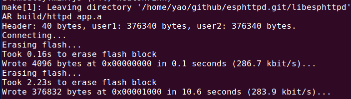
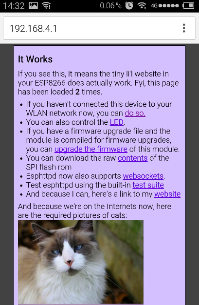
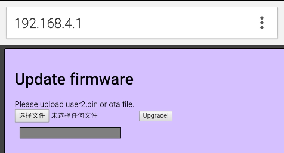
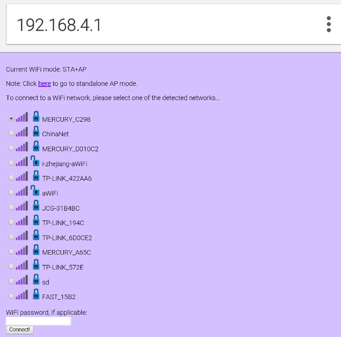
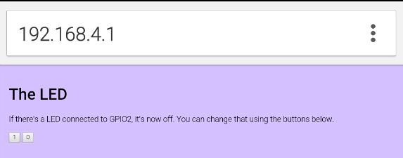

# How to run httpd server on LinkNode D1

This is the demonstration project for the small but powerful libesphttpd webserver for LinkNode D1. It is an example of how to make a module that can have the AP it connects to configured over a webbrowser. It also illustrates multiple flash layouts and some OTA update functionality.

## About the webserver ##

 - Supports multiple connections, for eg simultaneous html/css/js/images downloading
 - Static files stored in flash, in an (optionally compressed) RO filesystem
 - Pluggable using external cgi routines
 - Simple template engine for mixed c and html things
 - Usable as an embedded library - should be easy to drop into your existing projects
 - Includes websocket support

## Source code ##
The official esphttpd repo lives at http://git.spritesserver.nl/esphttpd.git/ and 
http://git.spritesserver.nl/libesphttpd.git/ . 

If you're a fan of Github, you can also peruse the official mirror at https://github.com/Spritetm/esphttpd and https://github.com/Spritetm/libesphttpd . If you want to discuss this code, there is a subforum at esp8266.com: http://www.esp8266.com/viewforum.php?f=34 .


## About the example ##

When you flash the example into an ESP8266(EX) module, you get a small webserver with a few example pages. If you've already connected your module to your WLAN before, it'll keep those settings. When you haven't or the settings are wrong, keep GPIO0 for >5 seconds. The module will reboot into its STA+AP mode. Connect a computer to the newly formed access point and browse to **http://192.168.4.1/wifi** in order to connect the module to your WiFi network. The example also allows you to control a LED that's connected to GPIO2.

## Build everything ##
### Required
* [toolchain for ESP8266](https://github.com/jcmvbkbc/crosstool-NG)
* [esptool for flash ESP8266](https://github.com/themadinventor/esptool)
* [esp-open-sdk](https://github.com/pfalcon/esp-open-sdk)

For this, you need an environment that can compile ESP8266 firmware. Environments for this still are in flux at the moment, but I'm using esp-open-sdk:
https://github.com/pfalcon/esp-open-sdk . 

You probably also need an UNIX-like system; I'm working on Debian Linux myself. 

To manage the paths to all this, you can source a small shell fragment into your current session. For example, I source a file with these contents:

    export PATH=${PWD}/esp-open-sdk/xtensa-lx106-elf/bin:$PATH
    export SDK_BASE=${PWD}/esp-open-sdk/sdk
    export ESPTOOL=${PWD}/esptool/esptool.py
    export ESPPORT=/dev/ttyUSB0
    export ESPBAUD=460800

Actual setup of the SDK and toolchain is out of the scope of this document, so I hope this helps you enough to set up your own if you haven't already. 

If you have that, you can clone out the source code:

    git clone http://git.spritesserver.nl/esphttpd.git/


This project makes use of heatshrink, which is a git submodule. 

* To fetch the code:

    cd esphttpd
    git submodule init
    git submodule update

* Configure the flash mode as `DIO`:

    vim Makefile

```bash
#0: QIO, 1: QOUT, 2: DIO, 3: DOUT
ESP_FLASH_MODE=2
```

* Now, build the code:
    make USE_OPENSDK=yes
Note:  You can also edit the Makefile to change this more permanently.

* Download the program: 
    make flash



## Pages of webserver##
You should have a working webserver now.

* Main page of this webserver


* Update firmware via WiFi


* STA+AP mode, configure the WiFi.


* Turn on or off Build-in LED on LinkNodeD1



