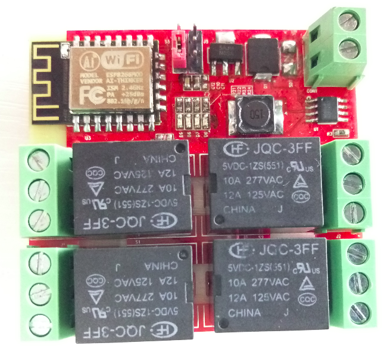
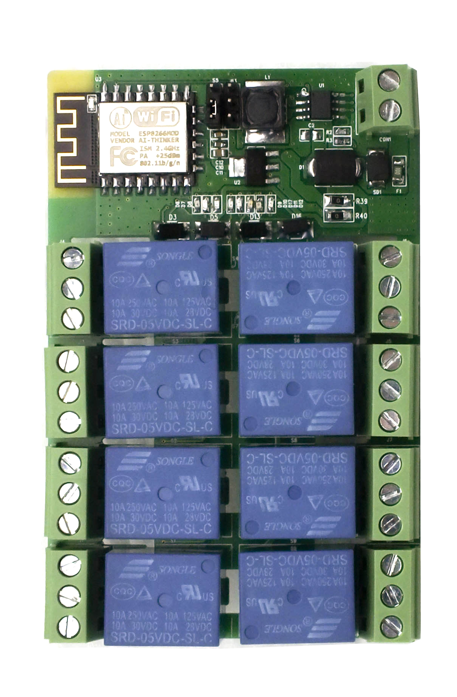
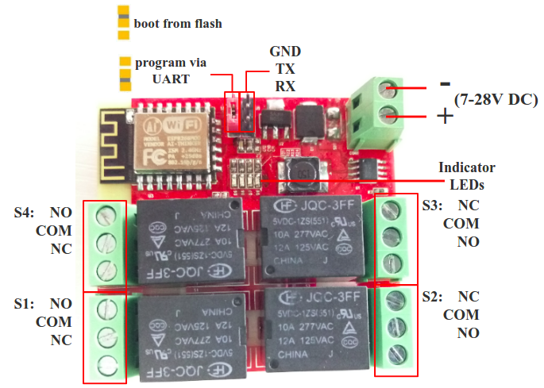
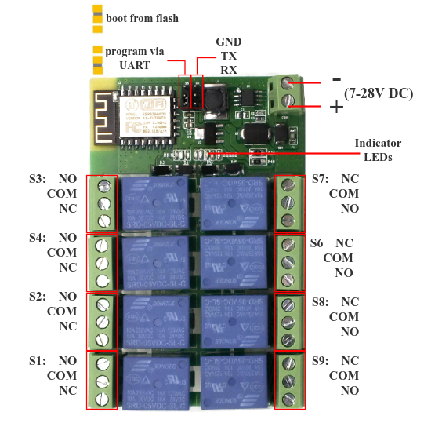
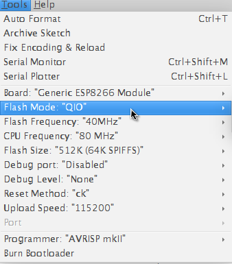
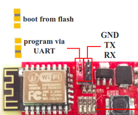

# LinkNode R4/R8: Arduino-compatible WiFi relay controller

## Introduction
LinkNode R4/R8 is a WiFi relay controller and it is powered by **ESP-12f ESP8266 WiFi module** which is comptiable with Arduino programming. There are 4/8 relay channels and each channel allows you to control high-power devices (up to 10 A) via the on-board relay. LinkNode R4/R8 can be used to remotely turn lights, fans and other devices on/off. The WiFi interface will allow you to associate the board with your existing WiFi network and send the commands over the network.

#### LinkNode R4


#### LinkNode R8


## Features
- ESP-12f ESP8266 WiFi module
- 4 Channel relays for **LinkNode R4**，supporting:
	- 277V AC， 10A
	- 125V AC， 12A
- 8 channel relays for **LinkNode R8**,supporting:
	- 277V AC， 10A
	- 125V AC， 12A	
- 7-28V DC power
- Two work modes:
  - Program via UART
  - Boot from flash
- 4 indiator LEDs

### LinkNode R4 diagram


### LinkNode R4 control logic
| ESP8266 Pin | Control Signal|Relays'status|Indicator LED|
|:--------:|:--------:|:----:|:-----:|
|GPIO12 | 0 |S3 off| D6 off|
|GPIO12| 1 | S3 on|D6 on|
|GPIO13| 0 | S4 off|D7 off|
|GPIO13 | 1 | S4 on |D7 on|
|GPIO14 |0 |S2 off|D8 off|
|GPIO14 |1 |S2 on|D8 on|
|GPIO16 | 0 |S1 off|D9 off
|GPIO16 | 1 |S1 on|D9 on|

### LinkNode R8 diagram

### LinkNode R8 control logic
| ESP8266 Pin | Control Signal|Relays'status|Indicator LED|
|:--------:|:--------:|:----:|:-----:|
|GPIO12 | 0 |S3 off| D6 off|
| GPIO12| 1 | S3 on|D6 on|
| GPIO13| 0 | S4 off|D7 off|
|GPIO13 | 1 | S4 on |D7 on|
|GPIO14 |0 |S2 off|D8 off|
|GPIO14 |1 |S2 on|D8 on|
|GPIO16 | 0 |S1 off|D9 off
|GPIO16 | 1 |S1 on|D9 on|
|GPIO4 | 0 |S6 off| D17 off|
|GPIO4| 1 | S6 on|D17 on|
|GPIO5| 0 | S7 off|D10 off|
|GPIO5 | 1 |S7 on |D10 on|
|GPIO9 |0 |S8 off|D11 off|
|GPIO9 |1 |S8 on|D11 on|
|GPIO10 | 0 |S9 off|D12 off
|GPIO10 | 1 |S9 on|D12 on|

## Tutorial
Because the only difference between LinkNode R4 and LinkNode R8 is the number of relays, other things are all same including control logic and programming.So make it simple, this tutorial will take LinkNode R4 as an example.

### 1. Get started in Arduino programming

#### a. Requirements
**Software**
* [Arduino IDE](https://www.arduino.cc/en/Main/Software), (the latest version is **1.6.8** )
* The [Arduino core](https://github.com/esp8266/Arduino.git) for LinkNode R4

** Hardware**
* 12V/1A-15V/1A DC power is recommanded.
* USB TTL UART cable

#### b. Install Arduino core for ESP8266
- Install Arduino 1.6.8 from the [Arduino website](http://www.arduino.cc/en/main/software).
- Start Arduino and go to **File --> Preferences** .
- Enter ```http://arduino.esp8266.com/stable/package_esp8266com_index.json``` into **Additional Board Manager URLs** field. You can add multiple URLs, separating them with commas.


- Open Boards Manager from **Tools --> Board menu --> Boards Manager**.

- Search and install **esp8266** platform (and don't forget to select your ESP8266 board from Tools --> Board menu after installation).


#### c. Check the configuration of Board
Because the LinkNode R4 has not been added into the offcial ESP8266 Arduino core repository yet, so you can't find this board on the boards list, but you can use the **Generic ESP8266 Module**, and select Flash Mode as **QIO**.


#### d. Create a Arduino Project
* Enter the following source code and compile

```C
/*Turn on and off the S3 relay in every second */
void setup()
{
  pinMode(12,OUTPUT); 
  Serial.begin(9600); 
}

void loop()
{
  digitalWrite(12,HIGH);
  Serial.println("Relay ON\n");
  delay(1000);
  digitalWrite(12,LOW);
  Serial.println("Relay OFF\n");
  delay(1000);  
}
```

#### e. Test

* Jump out the **S5** on LinkNode R4 and select **program via UART** 
* Connect DC power to LinkNode R4
* Connect USB TTL UART cable to UART port of LinkNode R4
* Connnect the other side to PC  
* Check your serial port which your PC recognize
* Click the ***Upload** on Arduino IDE
* After finished, jump out the **S5** on LinkNode R4 and select **boot from flash**

### 2. Remotely control LinkNode R4 with LinkSprite.IO platform

[LinkSprite IO](www.linksprite.io) is an IoT platform which supports RESTful API and WebSocket. These make the mobile APP, website application or device connect it very easily. The following I will introduce is about how to use LinkNode R4 to communicate with LinkSprite IO platform.

#### a. Create a new account and device on LinkSprite.io
* Go to www.linksprite.io and sign up
* Enter your Email and password to create a new account
* Go to **My Account** to get your own API Key. The API Key is fatal because only add the Key in your codes, can the data sync to your IoTgo account.


* Click **My Device**, and choose **Create DIY Device**.


* Click the created device icon and get the DeviceID.


#### b. Query the source code using your own apikey and device ID
Device API which the LinkSprite IO support is JSON-based, which means all request and response data is enclosed in JSON format. Currently it supports 3 kind of request.
* **Update**: Update device status to LinkSprite IO
* **Query**: Get device status from LinkSprite IO

This demo will send http POST request to query the param--light on linksprite.io, if the **light** is on, then turn one relay on, if off, then turn off the relay.

#### c. Install WiFi Manager library
To make it more convinent, we add WiFi manager library in this demo.

The ESP8266 WiFi Connection manager with web captive portal, this Arduino library can make configure AP's SSID and password via web page when you want LinkNode R4 to connect to AP.

* Open Arduino IDE and go to **Sketch --> Include Library --> Manage Libraries**
* Search the **wifimanager** and install it


#### d. Develope source code
* Enter the following source code
* Configure your **apikey** and **deviceID** in the source code

```c
#include <ESP8266WiFi.h>
#include <WString.h>

//the library are needed for autoconfig WiFi
#include <DNSServer.h>
#include <ESP8266WebServer.h>
#include <WiFiManager.h>       

// replace with your own API key and device ID,
String apikey = "xxxxxxxxxxxxxxxxxxxxxxxxxxxx";
const char* deviceID="xxxxxxxxxxxxx";

const char* server = "www.linksprite.io";

WiFiClient client;

void setup() {                
  Serial.begin(115200);
  pinMode(12, OUTPUT);

  WiFiManager wifiManager;

  wifiManager.setAPStaticIPConfig(IPAddress(10,0,1,1), IPAddress(10,0,1,1), IPAddress(255,255,255,0));
  wifiManager.autoConnect("LinkNodeAP");

  Serial.print("WiFi Connected ...\n");
  Serial.println("WiFi connected");
}

void loop() {

  if (client.connect(server,80)) {  
  String  postStr ="{";
          postStr +="\"action\":\"query\",";
          postStr +="\"apikey\":\"";
          postStr += apikey;
          postStr +="\",";
          postStr +="\"deviceid\":\"";
          postStr += deviceID;
          postStr +="\",";
          postStr += "\"params\":";
          postStr += "[";
          postStr += "\"light\"";
          postStr +="]";
          postStr +="}";

     client.print("POST /api/http HTTP/1.1\n");
     client.print("Host: ");
     client.print(server);
     client.print("\nContent-Type: application/json\n");
     client.print("Content-Length: ");
     client.print(postStr.length());
     client.print("\n\n");
     client.print(postStr);     
  }
  delay(1000);

  Serial.println("Store response...");
  String request = "";
  while (client.available()) {
    char c = client.read();
    request +=c;
  }

  if (request!= NULL)
  {
    int index1 = request.indexOf(":{");
    int index2 = request.indexOf("},");
    String param = request.substring(index1, index2 + 1);
    Serial.print("The param is ");
    Serial.println(param);

    if(param.indexOf("off")>0){
        digitalWrite(12, LOW);    
        Serial.println("OFF");
    } else if(param.indexOf("on")>0){
        digitalWrite(12, HIGH);    
        Serial.println("ON");
    }

  client.stop();
  Serial.println("Waiting...");    
  delay(2000);  
  }
}

```

#### e. Configure to accece WiFi AP
* Take the step above to upload the program, the LinkNode R4 will create a AP called **LinkNodeAP**
* Use your mobile phone to connect this AP
* Open a browser and enter the ip address **10.0.1.1** and you will see the following website:


* Click the button **configure WiFi**
* Select your WiFi AP which you want to connect and enter your wifi password.
* If connecting failed, you can go to the same website to configure it again.
* Also, you can use Serial Monitor in Arduino IDE to check the status.
* After that, LinkNode R4 will connect to Linksprite IO via the internet.


#### f. Test
* Open the serial monitor to check the status


* Open your light device which is create on linksprite.io
* Click the button **ON** and **OFF**
* Check the status of relay on LinkNode R4, is it following your control? 
