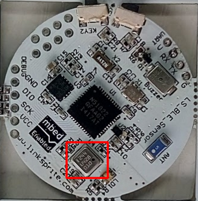
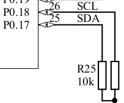
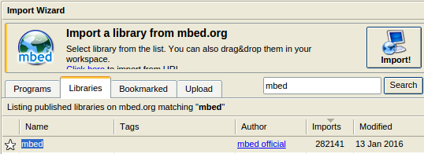
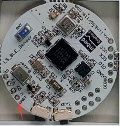
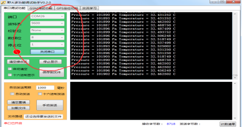

# BMP180 barometric pressure sensor

## Introduction

The BMP180 offers a pressure measuring range of 300 to 1100 hPa with an accuracy down to 0.02 hPa in advanced resolution mode. It’s based on piezo-resistive technology for high accuracy, ruggedness and long term stability. The chip only accepts 1.8V to 3.6V input voltage.



NRF51822 communicates with BMP180 using I2C port. The **SCL** port is connected to **P0.18** and **SDA** port is connected to **P0.17**.



This tutorial will introduce how to use BMP180 to get barometric pressure and temperature data and print these data to serial port. 

## Pre-requisites
* BLE SENSORS TAG x 1
* Micro USB cable x 1  
* USB UART cable

## Steps
* Open online mbed compiler and import a program from mbed.org.
* Search programs using **bmp180** keyword and you will find **BMP180_example** program.
* Import a mbed libraries into **BMP180_example**.



* Update the source code using the given source code below.
* Compile it, you will get hex file.
* Move it to jlink disk and program the BLE SENSORS TAG.

###Run and Test
* Connect USB UART cable to UART port on BLE SENSORS TAG.



* Open a serial program on PC to read the UART data sent from device.
	* Baud rate: 9600
	* Data : 8 bit
	* Stop: 1 bit
* There will be data printed on the serial window. 



## Source code

```c
#include <stdio.h>
#include "mbed.h"
#include "BMP180.h"

Serial pc(P0_23,P0_25);
DigitalOut led(P0_20);
I2C i2c(P0_17, P0_18);
BMP180 bmp180(&i2c);

int main(void) 
{
    led=0;
    while(1) 
    {
        if (bmp180.init() != 0) 
        {
            printf("Error communicating with BMP180\n");
        } 
        else 
        {
            printf("Initialized BMP180\n");
            break;
        }
        wait(1);
    }

    while(1) 
    {
        bmp180.startTemperature();
        wait_ms(5);     // Wait for conversion to complete
        float temp;
        if(bmp180.getTemperature(&temp) != 0) 
        {
            printf("Error getting temperature\n");
            continue;
        }
        bmp180.startPressure(BMP180::ULTRA_LOW_POWER);
        wait_ms(10);    // Wait for conversion to complete
        int pressure;
        if(bmp180.getPressure(&pressure) != 0) 
        {
            printf("Error getting pressure\n");
            continue;
        }

        printf("Pressure = %d Pa Temperature = %f C\n", pressure, temp);
        wait(1);
    }
}

```
