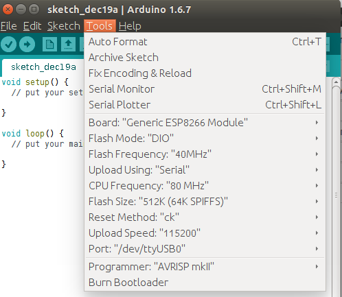

# How to install ESP8266 Arduino addon

There are a variety of development environments that can be equipped to program the ESP8266. You can go with a simple Notepad/gcc setup, or fine-tune an Eclipse environment, use a virtual machine provided by Espressif, or come up with something of your own.

Fortunately, the amazing ESP8266 community recently took the IDE selection a step further by creating an Arduino addon. If you’re just getting started programming the ESP8266, this is the environment we recommend beginning with, and the one we’ll document in this tutorial.

This ESP8266 addon for Arduino is based on the amazing work by Ivan Grokhotkov and the rest of the ESP8266 community. Check out the [ESP8266 Arduino GitHub repository](https://github.com/esp8266/Arduino) for more information.

## Windows

### 1. Installing the Addon With the Arduino Boards Manager

With the release of Arduino 1.6.4 or newer , adding third party boards to the Arduino IDE is easily achieved through the new board manager. If you’re running an older version of Arduino (1.6.3 or earlier), we recommend upgrading now. As always, you can download the latest version of Arduino from arduino.cc.

To begin, we’ll need to update the board manager with a custom URL. Open up Arduino, then go to the Preferences (File > Preferences). Then, towards the bottom of the window, copy this URL into the “Additional Board Manager URLs” text box:

`http://arduino.esp8266.com/stable/package_esp8266com_index.json`

If you already have a URL in there, and want to keep it, you can separate multiple URLs by placing a comma between them. (Arduino 1.6.5 added an expanded text box, separate links in here by line.)


### 2. Adding Board Manager URL to Arduino preferences

Hit OK. Then navigate to the Board Manager by going to **Tools > Boards > Boards Manager**. There should be a couple new entries in addition to the standard Arduino boards. Look for **esp8266**. Click on that entry, then select Install.

### 3. Installing additional boards from Board Manager

The board definitions and tools for the ESP8266 Thing include a whole new set of gcc, g++, and other reasonably large, compiled binaries, so it may take a few minutes to download and install (the archived file is ~110MB). Once the installation has completed, an Arduino-blue “INSTALLED” will appear next to the entry.


### 4. Set board type
Go to **Tools > Boards**, you will find ESP8266 Module.

## Ubuntu 14.04  

### 1. Install Arduino IDE 1.6.7

```bash
wget https://downloads.arduino.cc/arduino-1.6.7-linux64.tar.xz
tar -xvf arduino-1.6.7-linux64.tar.xz
mv arduino-1.6.7 /opt/
/opt/arduino-1.6.7/install.sh
```
Install the required Java Runtime Environment with:

```bash
sudo apt-get install openjdk-7-jre
```

Change the USB file mode and add yourself to dialout group, or you will get permmission denied error:
```bash
sudo chmod a+rw /dev/ttyACM0 #It depends on your USB device. 
sudo addusers <yourname> dialout
```

### 2. Install ESP8266 packages into Arduino IDE
* Go to Arduino directory
* Clone the ESP8266 repository into hardware/esp8266com/esp8266 directory (or clone it elsewhere and create a symlink)
```bash
cd /opt/arduino-1.6.7/hardware
mkdir esp8266com
cd esp8266com
git clone https://github.com/esp8266/Arduino.git esp8266
```

* Download binary tools (you need Python 2.7)
```bash
cd esp8266/tools
python get.py
```

### 3. Set Board type
Go to **Tools > Board** and select "**Generic ESP8266 Module**".


## Reference
1. [Install the ESP8266 Arduino addon](https://learn.sparkfun.com/tutorials/esp8266-thing-hookup-guide/installing-the-esp8266-arduino-addon)
2. [ESP8266 Arduino GitHub repository](https://github.com/esp8266/Arduino)