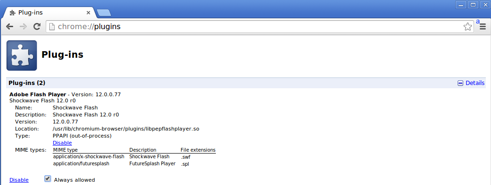

#How to install flash plugin on pcDuino8 Uno 
On pcDuino8 Uno, if you want to viewer website which contains flash content, the browser will notice you that you should install flash plugin. And this post will tell you how to install this flash plugin.

It is best used on pcDuino8 Uno, because this is pure software rendered and will use a lot of CPU. You need to have Chromium installed.

```bash
wget https://s3.amazonaws.com/pcduino/Tools/PepperFlash-12.0.0.77-armv7h.tar.gz 
tar -xzf PepperFlash-12.0.0.77-armv7h.tar.gz
cd PepperFlash
chmod +x *
sudo cp * /usr/lib/chromium-browser/plugins
```

or later version. With the same steps as above, just replace version numbers as required.
```
Uncomment the line starting with "CHROMIUM_FLAGS=". Add the following line.
```
sudo vim  /etc/chromium-browser/default
```
Add the following line:
> CHROMIUM_FLAGS="--ppapi-flash-path=/usr/lib/chromium-browser/plugins/libpepflashplayer.so --ppapi-flash-version=12.0.0.77 -password-store=detect -user-data-dir"

* Save
* Open Chromium-browser
* Enter chrome://plugins
* The pepperflash-plugin should be visible. Enable it.
* Done




Flash animations work well, Flash video to a certain degree, depending on video resolution. There are reports though that Spotify specifically may not work because of lack of NPAPI in Pepper Flash, but some recent changes may have fixed it.

via: [How do I install/get the Flash player on Raspberry Pi?](http://raspberrypi.stackexchange.com/questions/30053/how-do-i-install-get-the-flash-player-on-raspberry-pi)
