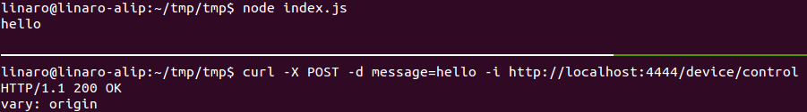

# How to install REST API server with Hapi node module
This post will tell you how to install REST API Server on pcDuino8 Uno.

### 1. Synchronize time
```bash
sudo ntpdate us.pool.ntp.org
```

### 2. Install Node and npm

Set up the apt-get repo source.
```bash
curl -sL https://deb.nodesource.com/setup | sudo -E bash -
sudo apt-get install -y nodejs
sudo ln -s /usr/bin/nodejs /usr/bin/node
sudo apt-get install -y npm
echo "export NODE_PATH=<your local node_modules file path>" >> ~/.bashrc
source ~/.bashrc
```
Note: Global node_modules file path shuold be /usr/lib/node_modules, or /usr/local/lib/node_moduels/

### 3. Install required node modules with npm
```bash
sudo npm install hapi -g
```

### 4. Write JavaScript code
```bash
vim index.js
```
**index.js: REST API Server simple demo**
```js
var Hapi = require('hapi');

var server = new Hapi.Server();
var port = Number(process.env.PORT || 4444);

server.connection({ port: port, routes: { cors: true } });

server.route([
  {
    method: 'POST',
    path: '/device/control',
    handler: function (request, reply) {
      reply("Hi");
     console.log(request.payload.message);
    }
  }
]);

server.start();

```

### 5. Local test
Open a terminal to run server:
```bash
node index.js
```
Open another terminal to post a request:
```bash
curl -X POST -d 'message=hello' -i http://localhost:4444/device/control
```


