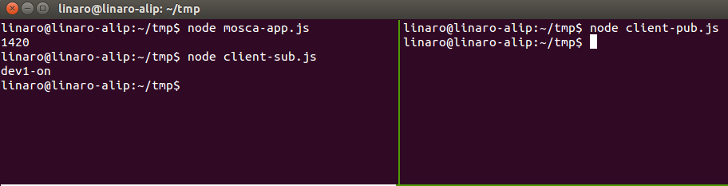

# Install MQTT Server on pcDuino8 Uno with Node.js

A pcDuino8 Uno makes a really great central hub for small IoT networks. It is very inexpensive, it consumes very little power and it has no fans or other mechanical parts that might cause failure. This post shows you the steps to get up and running with an MQTT broker.

Note: Ubuntu14.04 has been installed on pcDuino8 Uno.

### 1. Synchronize time
```bash
sudo ntpdate us.pool.ntp.org
```

### 2. Install Node and npm

Set up the apt-get repo source.
```bash
curl -sL https://deb.nodesource.com/setup | sudo -E bash -
sudo apt-get install -y nodejs
sudo ln -s /usr/bin/nodejs /usr/bin/node
sudo apt-get install -y npm
echo "export NODE_PATH=<your local node_modules file path>" >> ~/.bashrc
source ~/.bashrc
```
Note: Global node_modules file path shuold be /usr/lib/node_modules, or /usr/local/lib/node_moduels/

### 3. Install required node modules with npm
```bash
sudo npm install mosca -g
sudo npm install mqtt -g
sudo npm install daemon -g
```

### 4. Write JavaScript code
```bash
vim mosca-app.js
```
**mosca-app.js: MQTT-Server code**

```js
console.log(process.pid);
//require('daemon')();
 
var moscaSettings = {
  port: 1883,
  host: "localhost"
};
 
var server = new mosca.Server(moscaSettings);
server.on('ready', setup);
 
server.on('clientConnected', function(client) {
    console.log('client connected', client.id);     
});
 
server.on('published', function(packet, client) {
  console.log('Published', packet.payload);
});
 
function setup() {
  console.log('Mosca server is up and running')
}
console.log(process.pid);

```
```bash
vim client-pub.js
```

**client-pub.js: MQTT-pub client for test**
```js
var mqtt    = require('mqtt');
var client  = mqtt.connect('mqtt://localhost');

client.on('connect', function () {
  client.publish('device/control', 'Hello!', {retain: false, qa: 1});
client.end();
});

```
```bash
vim client-sub.js
```

**client-sub.js: MQTT-sub client for test**
```js
var mqtt    = require('mqtt');
var client  = mqtt.connect('mqtt://localhost');

client.on('connect', function () {
  client.subscribe('device/control');

client.on('message', function (topic, message) {
  console.log(message.toString());
client.end();
  });
});

```

### 5. Test MQTT Server
Open a terminal:
```bash
node mosca-app.js
node client-sub.js   ##Subscribe a message, the topic is 'device/control'
```
Open another terminal
```bash
node client_pub.js ##Publish a message, the topis is 'device/control'
```
client-sub.js will get a message published from client-pub.js.


