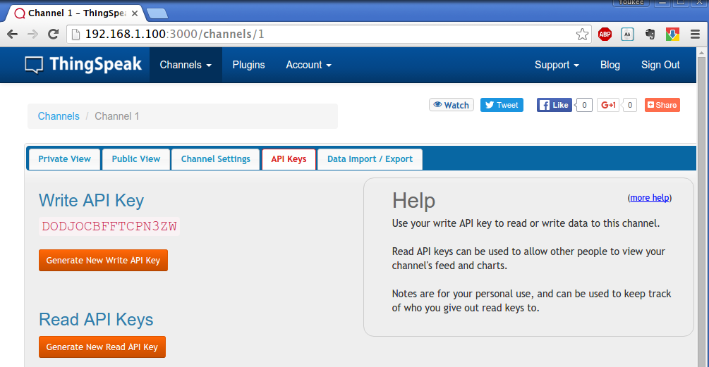

# How to Install ThinkSpeak Server Standalone 

Below is the full steps of a ThingSpeak Server installation process on Ubuntu14.04(x86_64) which is finished about 30 min.

### INSTALL Required packages:
```
sudo apt-get -y install build-essential git mysql-server mysql-client libmysqlclient-dev libxml2-dev libxslt-dev libssl-dev libsqlite3-dev  
```
### MySQL Database configuration
```
mysql --user=root mysql -p useyourpasswd
mysql> CREATE USER 'thing'@'localhost' IDENTIFIED BY 'speak';
mysql> GRANT ALL PRIVILEGES ON *.* TO 'thing'@'localhost' WITH GRANT OPTION;
mysql> commit;
mysql> exit;
```

### Ruby / Rails install
* Download and compile
```
wget http://cache.ruby-lang.org/pub/ruby/2.1/ruby-2.1.5.tar.gz
tar xvzf ruby-2.1.5.tar.gz
cd ruby-2.1.5
./configure
make
```
> MAKE RESULT:  
Files:        962
>
  Classes:     1414 ( 566 undocumented)  
  Modules:      268 (  87 undocumented)  
  Constants:   2098 ( 624 undocumented)  
  Attributes:  1146 ( 272 undocumented)  
  Methods:    10652 (2229 undocumented)  
>  Total:      15578 (3778 undocumented)  
>   75.75% documented  
>   Elapsed: 469.0s  

* Install ruby
```
sudo make install
cd ..
echo "gem: --no-rdoc --no-ri" >> ${HOME}/.gemrc
sudo gem install rails 
```

**Note:**
If you get some error when you install rails, please check the following note. Hope it is helpful.

1. 
When you run `gem install rails`, if you get the following error:

> ERROR:  Could not find a valid gem 'rails' (>= 0), here is why:  
>          Unable to download data from https://rubygems.org/ - Errno::ECONNRESET: Connection reset by peer - SSL_connect (https://api.rubygems.org/latest_specs.4.8.gz)

You need to change another source using the following commands:

```
gem sources --add https://ruby.taobao.org/ --remove https://rubygems.org/
gem sources -l
*** CURRENT SOURCES ***
https://ruby.taobao.org
# So make sure ruby.taobao.org
$ gem install rails

```

### ThingSpeak Server install
* Download the ThingSpeak source code
```
git clone https://github.com/iobridge/thingspeak.git
cp thingspeak/config/database.yml.example thingspeak/config/database.yml
cd thingspeak
bundle install
bundle exec rake db:create
```
**Note:**
1. 
If you get error when you install sqlite3 , try the following commands:
```
sudo gem install sqlite3 -v '1.3.9'
```   
2. 
If you get an error when you install `libv8`, take the following commands:
```
sudo gem install libv8 -v '3.16.14.7' -- --with-system-v8
```
   
### Check MYSQL DB
```
mysql --user=root mysql -p
mysql> show databases;

#+----------------------------  +
#| Database                        |
#+----------------------------  +
#| information_schema        |
#| mysql                              |
#| performance_schema      |
#| thingspeak_development |
#| thingspeak_test               |
#+------------------------------+
mysql> exit; 

```
* If MYSQL DB is OK, then run:

```
bundle exec rake db:schema:load 
```

### Run the ThingSpeak Server 
```
rails server webrick.
```
Open a browser and enter `<your PC's IP addres>:3000` and you will get the website shown in the following picture.  


### Quick Start

1. **Sign Up** for a ThingSpeak account
2. Create a new Channel by going to your Channels page and clicking **Create New Channel**  

3. Update your Channel via URL:
`http://192.168.1.100:3000/update?api_key=YOUR_CHANNEL_API_KEY&field1=7`
4. View your Channel feed:
`http://192.168.1.100:3000/channels/YOUR_CHANNEL_ID/feeds.json`

More Details please check the **Support website**.

### ESP8266/NodeMCU Programming for ThingSpeak
If you want to use ESP8266 communicating with ThingSpeak server, you can reference this website:
http://www.arduinesp.com/thingspeak

This demo will plot DTH11 data on thingspeak server using an ESP8266.
Download source code here: [ThingspeakESP8266](http://www.arduinesp.com/arduinesp/wp-content/uploads/2015/04/ThingspeakESP8266.txt)
DHT library (from adafruit) can be downloaded [here](https://github.com/adafruit/DHT-sensor-library/archive/master.zip).


### Ref
1. https://github.com/iobridge/ThingSpeak
2. http://www.esp8266-projects.com/2015/05/raspberry-pi-standalone-thingspeak.html
3. [thingspeak-install.sh](https://gist.github.com/MarconiLab/f9f49cc473fa78ecfa72)
