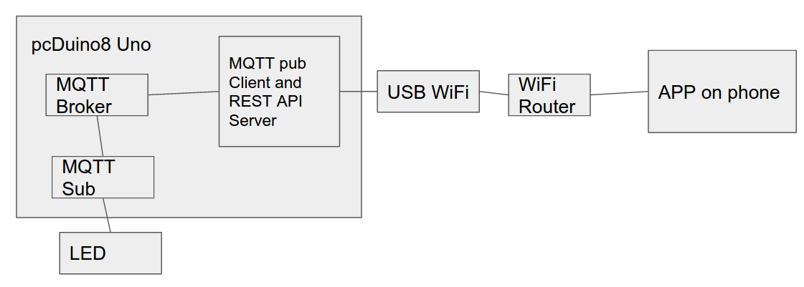
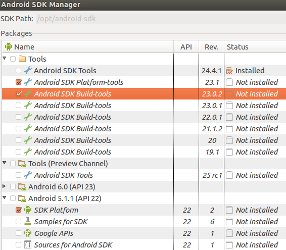
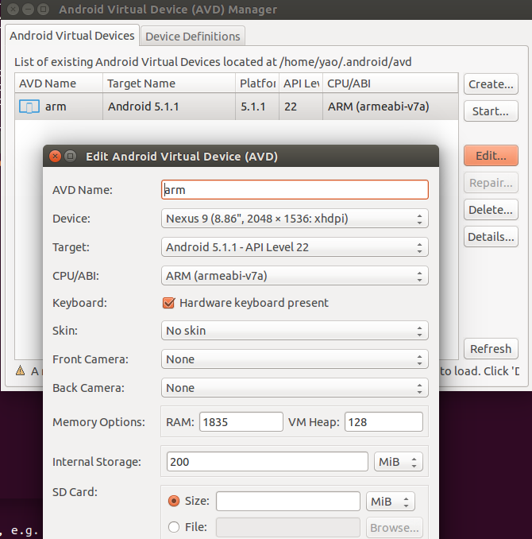
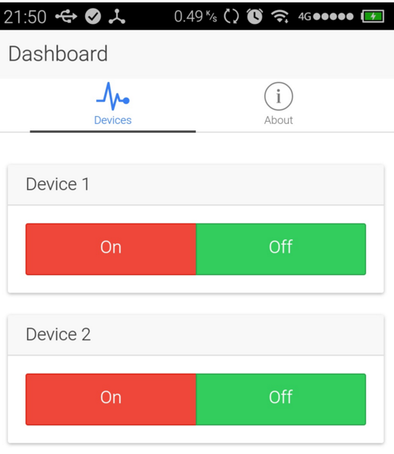
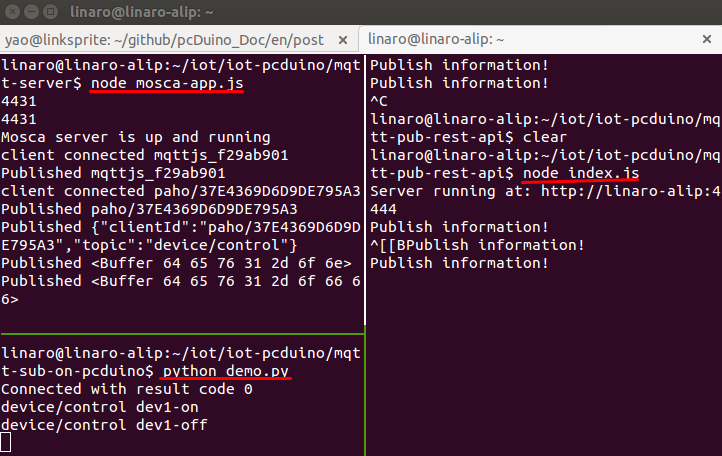

# Mobile App Controlled LED through pcDuino via MQTT+HTTP
The system is based on pcDuino8 Uno and run Node.js REST API server, MQTT Broker locally.The Android Mobile App is built using Ionic Framework utilizing AngularJs. 



##Requirements
### 1.Hardware
* pcDuino8 Uno
* 5V Power Supply ( at least 2A )
* WiFI Router
* USB WiFi(or using RJ45 to connect Router)

### 2. Software
* Node.js
* Ionic Framework
* python for pcduino

## Install MQTT Server on pcDuino8 Uno

### 1. Install node and npm
```bash
sudo ntpdate us.pool.ntp.org
sudo apt-get install curl
curl -sL https://deb.nodesource.com/setup_4.x | sudo -E bash -
sudo apt-get install -y nodejs
sudo ln -s /usr/bin/nodejs /usr/bin/node
sudo apt-get install -y npm
echo "export NODE_PATH=/usr/local/lib/node_modules" >> ~/.bashrc
source ~/.bashrc
```

### 2. Install MQTT node module
```
sudo npm install mosca -g
sudo npm install mqtt -g

```

### 3. Code for MQTT server
```js
console.log(process.pid);
//require('daemon')();

var moscaSettings = {
  port: 1883,
  host: "localhost"
};

var server = new mosca.Server(moscaSettings);
server.on('ready', setup);

server.on('clientConnected', function(client) {
    console.log('client connected', client.id);     
});

server.on('published', function(packet, client) {
  console.log('Published', packet.payload);
});

function setup() {
  console.log('Mosca server is up and running')
}
console.log(process.pid);
```


## RESE API Server + MQTT Client(Node.js)
```bash
sudo npm install hapi -g
```

### Write JavaScript code
```bash
vim index.js
```
**index.js: REST API Server simple demo**
```js
var Hapi = require('hapi');

var server = new Hapi.Server();
var port = Number(process.env.PORT || 4444);

server.connection({ port: port, routes: { cors: true } });

server.route([
  {
    method: 'POST',
    path: '/device/control',
    handler: function (request, reply) {
      reply("Hi");
     console.log(request.payload.message);
    }
  }
]);

server.start();

```

If you get this error, it means node version is lower than 4.0, and you should update the node, also update the npm using:
```
sudo npm install npm -g
```
>/usr/local/lib/node_modules/hapi/lib/index.js:5   
> const Server = require('./server');  
> ^^^^^  
>SyntaxError: Use of const in strict mode.  
>    at Module._compile (module.js:439:25)  
>    at Object.Module._extensions..js (module.js:474:10)  
>    at Module.load (module.js:356:32)  
>    at Function.Module._load (module.js:312:12)  
>    at Module.require (module.js:364:17)  
>    at require (module.js:380:17)  
>    at Object.<anonymous> (/home/linaro/iot/mqtt-pub-rest-api/index.js:1:74)  
>    at Module._compile (module.js:456:26)  
>    at Object.Module._extensions..js (module.js:474:10)  
>    at Module.load (module.js:356:32)  


## MQTT Client for Subscriber(Python)
```
sudo apt-get install python-pip
sudo pip install paho-mqtt
git clone https://github.com/YaoQ/iot-pcduino
cd mqtt-sub-on-pcduino
python demo.py
```

MQTT Client to control LED
```python
#!/usr/bin/env python
import paho.mqtt.client as mqtt
import json
import gpio
dev1_pin = "gpio19"
dev2_pin = "gpio18"
ip_address= "localhost"

def setup():
    gpio.pinMode(dev1_pin, gpio.OUTPUT)
    gpio.digitalWrite(dev1_pin, gpio.LOW)

def destroy():
    gpio.digitalWrite(dev1_pin,gpio.LOW)

def on_connect(client, userdata, flags, rc):
    print("Connected with result code " + str(rc))
    client.subscribe("device/control")

def on_message(client, userdata, msg):
    gpio_msc = str(msg.payload)
    print(msg.topic+" "+gpio_msc)
    
    if gpio_msc == 'dev1-on':
        gpio.digitalWrite(dev1_pin, gpio.HIGH)
    elif gpio_msc == 'dev1-off':
        gpio.digitalWrite(dev1_pin, gpio.LOW)
    elif gpio_msc == 'dev2-on':
	gpio.digitalWrite(dev2_pin, gpio.HIGH)
    elif gpio_msc == 'dev2-off': 
        gpio.digitalWrite(dev2_pin, gpio.LOW)

client = mqtt.Client()
client.on_connect = on_connect
client.on_message = on_message
setup()

try:
    client.connect(ip_address, 1883, 60)
    client.loop_forever()

except KeyboardInterrupt:
    client.disconnect()
    destroy()

```


## Develop APP using Ionic Framework(on Ubuntu 14.04 X64 PC)


### Install node and npm on PC
```
sudo apt-get install curl
curl -sL https://deb.nodesource.com/setup | sudo -E bash -
sudo apt-get install -y nodejs
sudo ln -s /usr/bin/nodejs /usr/bin/node
sudo apt-get install -y npm
echo "export NODE_PATH=/usr/local/lib/node_modules" >> ~/.bashrc
source ~/.bashrc
```

Require:

* Ionic 1.7.2
* cordova 5.4.1
* Android 5.1.1 (API 22)
* Android SDK Tools 24.4.1
* Android SDK Platform-tools 23.1
* Android SDK Build-tools 23.0.2

### Install JDK and android SDK
#### Install JDK
```bash
sudo apt-get install openjdk-7-jre
echo "export JAVA_HOME=/usr/lib/jvm/java-7-openjdk-amd64" >> ~/.bashrc
````

#### Download SDK
Go to [Andorid SDK](http://developer.android.com/sdk/index.html) and scroll down till you find the “Other Download Options” section. In the “SDK Tools Only” section, select the Linux package. Wait for the download to finish.

#### Extracting the SDK
By default, the downloads go to the Downloads folder in the home directory. We will, however, move the SDK archive to /usr/local and extract it there. Fire up a terminal window by pressing CTRL - ALT - T. Then type the following:
```bash
cd ~/Downloads
sudo mv android* /usr/local
cd /usr/local
sudo tar zxvf android*
```
Using ls will show you the android-sdk-linux folder.

#### Changing the Permissions
You also need to change the permissions for the android-sdk-linux. In the terminal window, type the following:
```bash
sudo chmod -R ugo+rwx android-sdk-linux
```

This will recursively give read, write, and execute permissions to the android-sdk-linux and all it’s children. This can take a few seconds to complete.

#### Setting the Environment Variables
You now need to set the environment variables. In your terminal window type the following:
```bash
sudo vim /etc/profile
```
and append the following:

> export PATH=${PATH}:/usr/local/android-sdk-linux/tools
> 
> export PATH=${PATH}:/usr/local/android-sdk-linux/platform-tools

Save the file. Now you need to reload these variables. In your terminal, type:

```bash
. /etc/profile
```
For the most part, you are done. There are a few additional libraries you need if you are on a 64-bit machine. If you are, type the following in your terminal:
```bash
sudo apt-get install lib32stdc++6
sudo apt-get install lib32z1
```

These are the 32-bit libraries that the Android SDK needs.

#### Checking the Setup
Time to check if all went well. Type the following in your terminal:
```bash
cd ~
android
```
This should fire up your Android SDK Manager.
#### Install SDK tools


If you want to emulate your app, you also should install an System Image and use `android avd` to manager your Android Virtual Device(AVD).

#### Manager Android Virtual Device(optional)
```
android avd
```


### Install cordova and ionic
```
sudo npm install -g cordova
sudo npm intall -g ionic
git clone https://github.com/YaoQ/iot-ionic
cd iot-ionic
vim www/js/services.js
```
```js
angular.module('starter.services', [])

.factory('Devices', function($http) {
  // Might use a resource here that returns a JSON array

  var ipServer = 'http://<your pcduino ip address>:4444';

  return {
    deviceCommand: function(data) {
      console.log(data.deviceNum);
      console.log(data.command);
      return $http.post(ipServer + '/device/control', data);
    }
  };
});
```

### Compile and gennerate APK file
```
ionic platform add android
ionic serve
ionic build android
```
The APK file is located at platforms/android/build/outputs/apk/android-debug.apk.

**Note：**
If your app can not access network please take the following commands:
```
ionic plugin add https://github.com/apache/cordova-plugin-whitelist.git
```

### Put all together

#### Install the generated APK on your android phone
```bash
git clone https://github.com/YaoQ/iot-pcduino
```
There are three directories:
- **mqtt-pub-rest-api**: Node.JS, used as REST API server and MQTT publisher that send the message.
- **mqtt-server **: Node.JS, used as MQTT server.
- **mqtt-sub-on-pcduino**: python script, used as mqtt subscriber to get the message and control the GPIO.

**Note**: If you can't connect between server and client, please make sure the change the localhost in the source code to your IP address.



### Run script file 


Click on and off bar on APP to check the status of LED7 and LED8!


