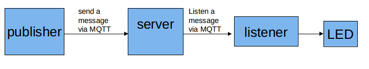
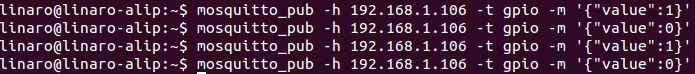
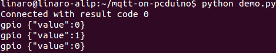

# Use MQTT protocol to control GPIO on the pcDuino8 Uno

This post will introduce how to install Mosquitto MQTT server on the pcDuino8 Uno, and how to use MQTT protocol to control GPIO.

Be carefull, don’t install Mosquitto directly from the standard Wheezy repositories (with apt-get install), otherwise It will be installed BUT you will miss the utility mosquitto_passwd that you need to setup the authentication with login and password.

So first let’s get the new repository and install the right version:

## 1. Install MQTT Server
```bash
wget http://repo.mosquitto.org/debian/mosquitto-repo.gpg.key
sudo apt-key add mosquitto-repo.gpg.key
cd /etc/apt/sources.list.d/
sudo wget http://repo.mosquitto.org/debian/mosquitto-wheezy.list
sudo apt-get update
sudo apt-get install mosquitto mosquitto-clients python-mosquitto
```
Then a little of configuration of Mosquitto server. First extract the configuration template that seats in /usr/share/doc… :
```bash
sudo sh -c 'zcat /usr/share/doc/mosquitto/examples/mosquitto.conf.gz > /etc/mosquitto/conf.d/mosquitto.conf'
```
The commands seems a bit complex but it is only to apply the sudo to the output redirection of zcat, otherwise you may not have the right permissions to write in that directory.

Then edit Mosquitto configuration file:
```bash
sudo vim /etc/mosquitto/conf.d/mosquitto.conf
```
To make the demo simple, I just use "allow_anonymous true" as default which means anyone can access Mosquitto server without authentication.

Now the server is properly configured, restart the service and you’re up to go:
```bash
sudo service mosquitto restart
```

## 2. Run demo
Note: To make a simple demo, I run all things on pcDuino8 Uno, without PC or Mobile phone as a message publisher.

Use mosquitto_pub command to send a gpio message with "value" prarameter to mosquitto server and take a python script as a listener to listen gpio message from server.



### Install paho-mqtt
```bash
sudo pip install paho-mqtt
```

### Get python script 
I write a python script as a listener and you can get it from my personal github repository.

```bash 
git clone https://github.com/YaoQ/mqtt-on-pcduino
cd mqtt-on-pcduino
vim demo.py
```
Go to the following line and modify the server's IP address which is depend on your network environment.
```python
try:
    client.connect("<your IP address>", 1883, 60)
```

### Run demo
```
python demo.py
```
Open another terminal and run the following commands to send a message:
```bash
mosquitto_pub -h <your IP address> gpio -m '"value":1'
mosquitto_pub -h <your IP address> gpio -m '"value":0'
mosquitto_pub -h <your IP address> gpio -m '"value":1'
```

Notice the information from the listener and the status of LED1 on pcDuino8 Uno.


## Ref
1. [How to make your raspberry pi the ultimate iot hub](http://blog.thingstud.io/recipes/how-to-make-your-raspberry-pi-the-ultimate-iot-hub/)
2. [Setup Mosquitto MQTT Server on the Raspberry Pi](http://www.mymakerprojects.com/index.php/setup-mosquitto-mqtt-server-on-the-raspberry-pi/)