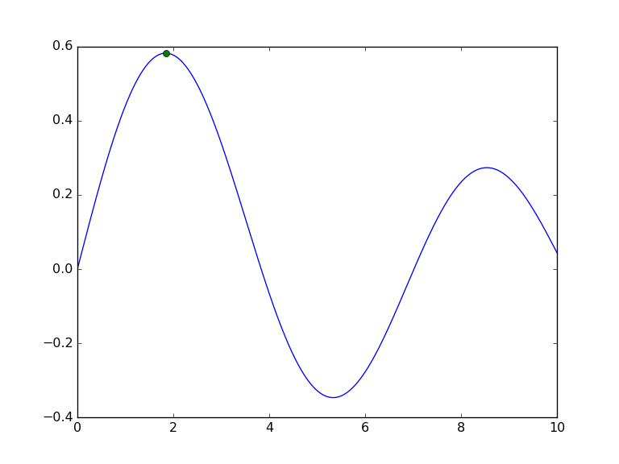
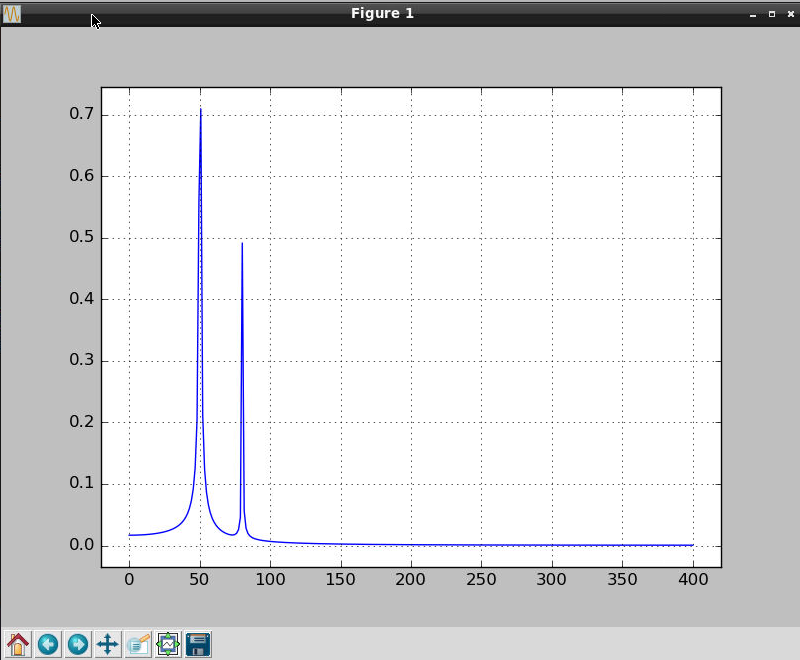

# SciPy on pcDuino8 Uno
**SciPy** (pronounced “Sigh Pie”) is a Python-based ecosystem of open-source software for mathematics, science, and engineering. In particular, these are some of the core packages:
- **NumPy** : Base N-dimensional array package
- **SciPy library** : Fundamental library for scientific computing
- **Matplotlib** : Comprehensive 2D Plotting
- **IPython** : Enhanced Interactive Console
- **Sympy** : Symbolic mathematics
- **pandas** : Data structures & analysis

This tutorial introduces the installation of **SciPy** on pcDuino8 Uno and quick start of Scipy.  

## Steps
### 1. Install the required libraries
```bash
sudo apt-get install libatlas-dev libavcodec-dev libavformat-dev libboost-all-dev libgtk2.0-dev libjpeg-dev liblapack-dev libswscale-dev pkg-config
sudo apt-get install python-dev python-pip cmake curl gfortran 
sudo apt-get install ipython
```
Although pcDuino8 Uno has 1GB ram, but when I install **numpy** or **scipy**, I get an error which is caused by the limitation of RAM. So before installing these software, I have to add swap partition to solve this problem.

### 2. Add swap partition   
Add 1GB as my swap partition.
```bash
sudo dd if=/dev/zero of=/var/swap.img bs=1M count=1000
sudo mkswap /var/swap.img
sudo swapon /var/swap.img
```

### 3. Install the required software

```bash
sudo pip install numpy    # nearly 2 hours
sudo pip install scipy    # nearly 1.5 hours
sudo pip install pandas   
sudo pip install scikit-learn 
sudo pip install scikit-image
sudo pip install matplotlib
```

## Example
### Bessel function
To give a simple example of typical interactive use, we find and plot the maximum of a Bessel function. 
Get a `example.py` from [SciPy.org](1), the python script is shown as follow:
```python
"""example.py

Compute the maximum of a Bessel function and plot it.

"""
import argparse

import numpy as np
from scipy import special, optimize
import matplotlib.pyplot as plt

def main():
    # Parse command-line arguments
    parser = argparse.ArgumentParser(usage=__doc__)
    parser.add_argument("--order", type=int, default=3, help="order of Bessel function")
    parser.add_argument("--output", default="plot.png", help="output image file")
    args = parser.parse_args()

    # Compute maximum
    f = lambda x: -special.jv(args.order, x)
    sol = optimize.minimize(f, 1.0)

    # Plot
    x = np.linspace(0, 10, 5000)
    plt.plot(x, special.jv(args.order, x), '-', sol.x, -sol.fun, 'o')

    # Produce output
    plt.savefig(args.output, dpi=96)

if __name__ == "__main__":
    main()

```
Run the following command and you will get a picture.
```
python example.py --output example.png --order 1
```


### FFT Function
The example plots the FFT of the sum of two sines. Details please go to this [website](2).
```python

from scipy.fftpack import fft
# Number of samplepoints
N = 600
# sample spacing
T = 1.0 / 800.0
x = np.linspace(0.0, N*T, N)
y = np.sin(50.0 * 2.0*np.pi*x) + 0.5*np.sin(80.0 * 2.0*np.pi*x)
yf = fft(y)
xf = np.linspace(0.0, 1.0/(2.0*T), N/2)
import matplotlib.pyplot as plt
plt.plot(xf, 2.0/N * np.abs(yf[0:N/2]))
plt.grid()
plt.show()
```


**Note**: because the default backend of matplotlib is agg, it can not plot the image, but you can save the image as a file. 

## Resolved: Matplotlib figures not showing up or displaying
Luckily, we can resolve this issue by using `apt-get`  to install a few libraries:
```
sudo apt-get install tcl-dev tk-dev python-tk python3-tk
```
But we’re not quite done yet. In order to get matplotlib to recognize the TkInter GUI library, we need to:

1. Use pip to uninstall matplotlib (since we installed it via pip earlier in this article).
2. Pull down matplotlib from the GitHub repo.
3. Install matplotlib  from source using setup.py .

I can accomplish these steps using the following commands:
```bash
pip uninstall matplotlib
git clone https://github.com/matplotlib/matplotlib.git
cd matplotlib
python setup.py install
```
After **matplotlib**  has been installed via source, let’s execute the `get_backend()`  function:
>linaro@linaro-alip:~/matplotlib$ python
Python 2.7.6 (default, Mar 22 2014, 23:30:12) 
[GCC 4.8.2] on linux2
Type "help", "copyright", "credits" or "license" for more information.
\>>> import matplotlib
\>>> matplotlib.get_backend()
u'TkAgg'

Sure enough, we now see the `TkAgg` is being used as the **matplotlib** backend.

[1]:http://www.scipy.org/getting-started.html
[2]:http://docs.scipy.org/doc/scipy/reference/tutorial/fftpack.html
