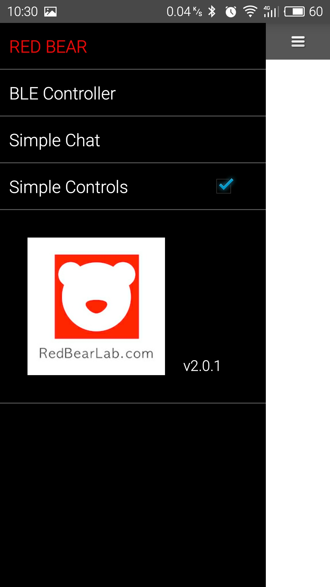
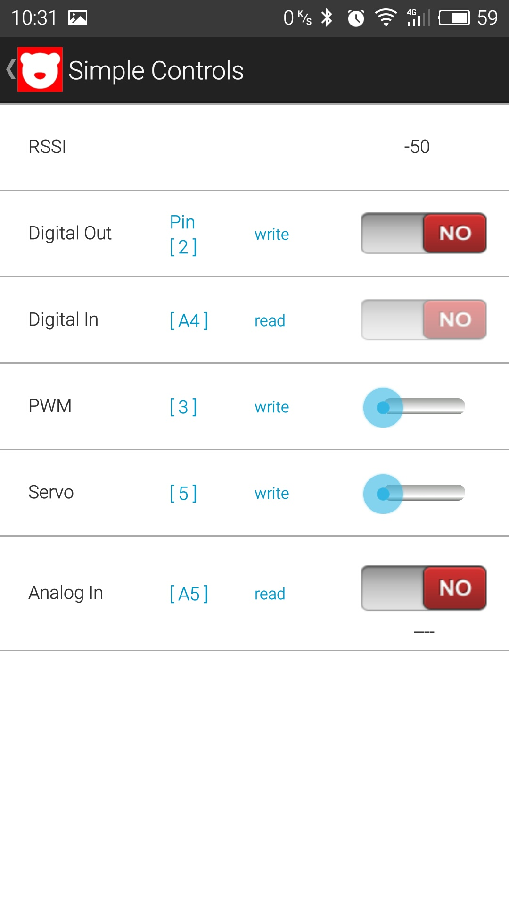
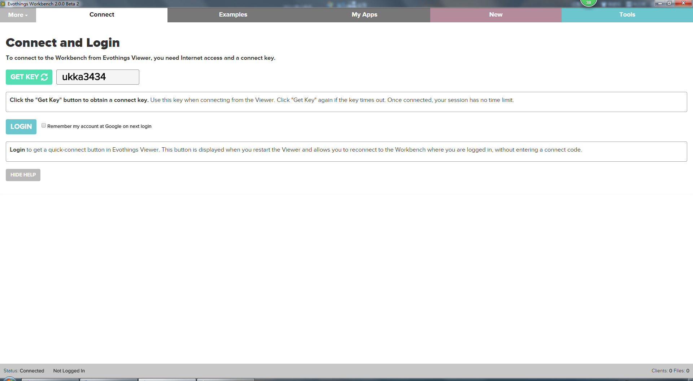
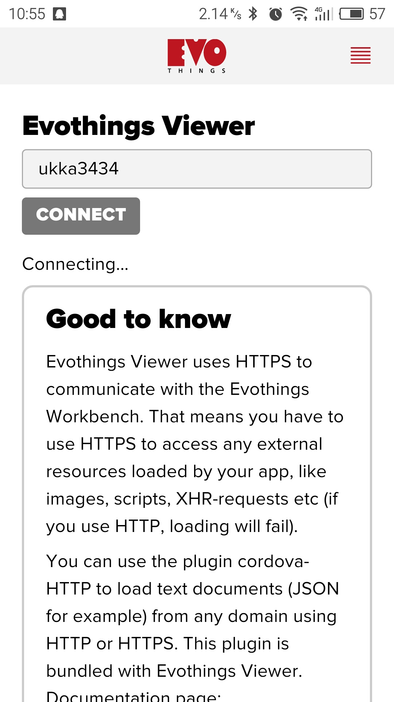
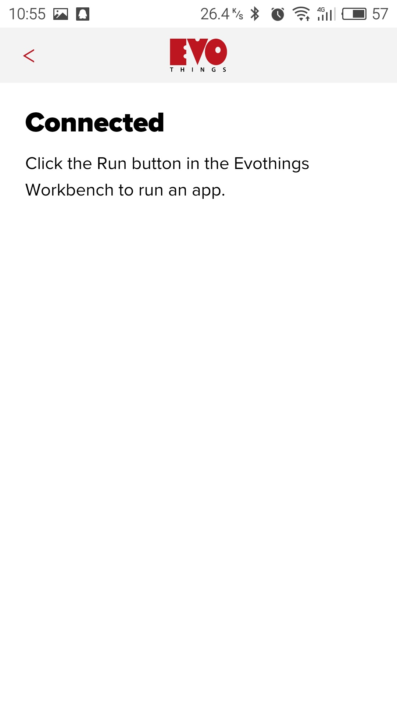
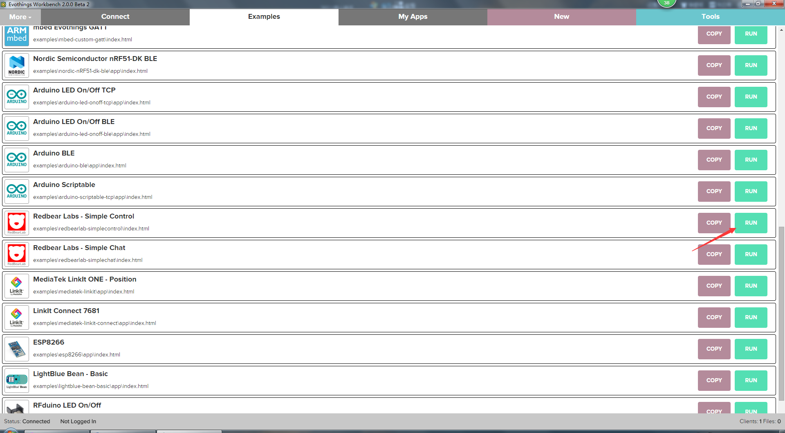
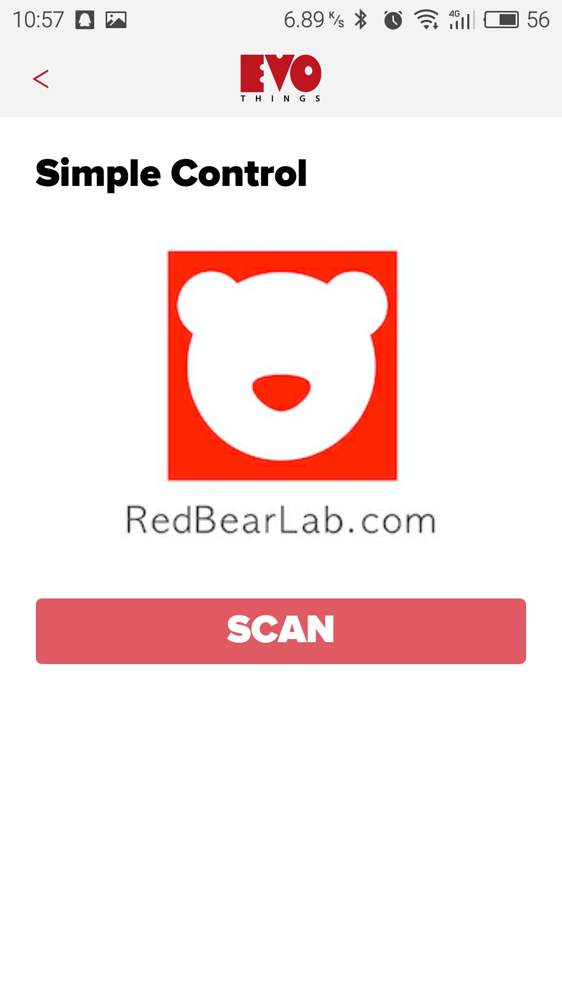

# How to use Android to control LinkNode

## 1. Download the BLE demo project 
[This LinkNode_SimpleControls project](https://developer.mbed.org/users/helloqi/code/LinkNode_SimpleControls/) is open source and you can import this project to your own mBed online compile environment, just click the on button **Import this program** on the right of page.
* Go to mbed online compiler and compile this project
* You will get a hex file and move it to the disk of LinkNode
* Now downloading the program is finished. 

## 2. Download the Android APK file
This [APK file](http://redbearlab.com/blecontroller.apk) is developed by [RedBearLab](www.redbearlab.com).
* Downlod the [APK file](http://redbearlab.com/blecontroller.apk)
* Install it on your Android mobile phone which supports BLE4.0 or later

## 3. Run APP to control the LinkNode

* Power on LinkNode
* Turn on the bluetooth on you mobile
* Open the APP and select **Simple Controls**

* Go to Simple Control page

* Scan the Bluetooth node named **Biscuit** which is hosted by LinkNode.

* Use control bar to communicate with LinkNode

|Pin Function|Description|LinkNode Pin Number|
|---|---|---|
|Digital Out|Control the Red LED on or off|P0_20|
|Digital In |Read the status of key2|P0_29|
|PWM|Control the Blue LED's brightness using PWM|P0_19|
|Servo|Control buzzer using servo|P0_22|
|Analog In| Read the 1/4 of input power level|P0_1|

## Develop your own APP
If you want to develop your own APP based on this project, you can use [Evothings Studio](http://evothings.com/) which is a mobile application platform and let you build apps with familar web technologies such as html, CSS and javaScript.

The following section will introduce the basic workflow of this tools and how to build your own APPs.

* Download and install the [Evothings Studio](http://evothings.com/download/) on your host PC
* Install [Evothings Viewer app](http://evothings.com/download/) on your Android or iOS device
* Open Evothings Studio on your PC and you will get the following window, then click the **GET KEY** button.

* On your Mobile phone side, you shuold enter this KEY 
**Note**: make sure your mobile and host PC are in the same LAN.

* After connceted, click the Run button in the Evothings Studio.

* The Simple Control project will run on the Evothings Views APP

* If you click the COPY buttion, you will get the Cordova project which is based on HTML5 website. And using [cordova tool](https://cordova.apache.org/), you can modify and build your own App, details please check this [Evothings Studio Starter Guide](https://evothings.com/doc/starter-guides/evothings-studio-starter-guide.html)

