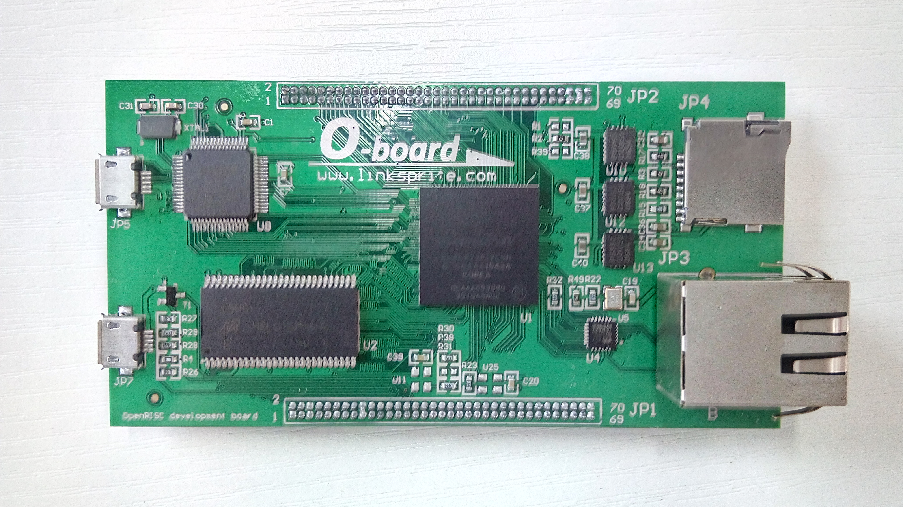
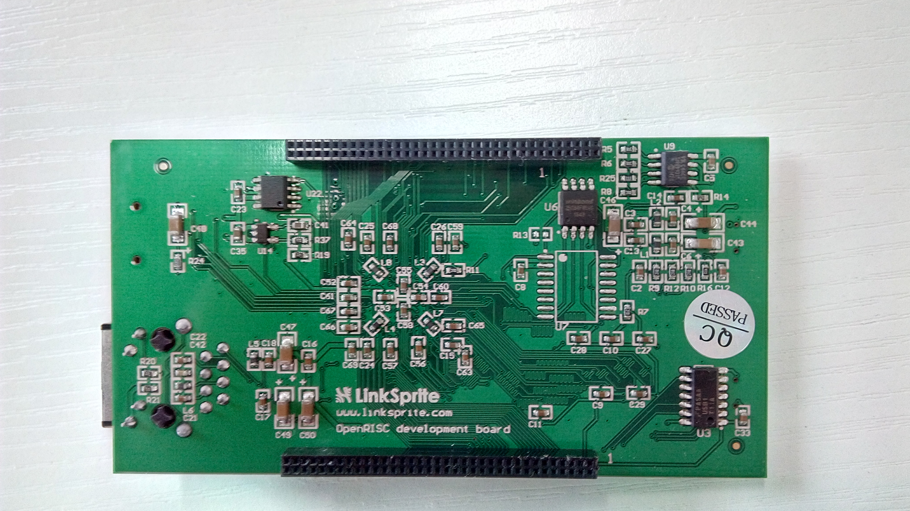
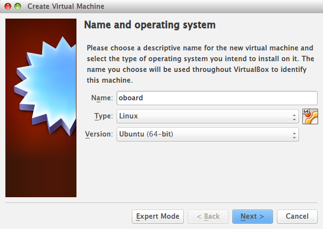
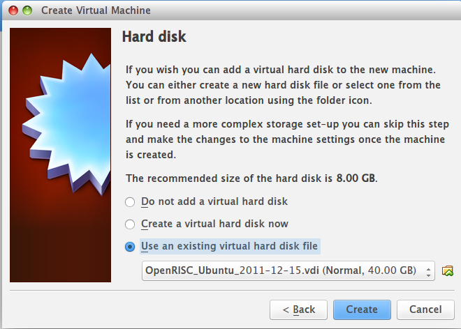
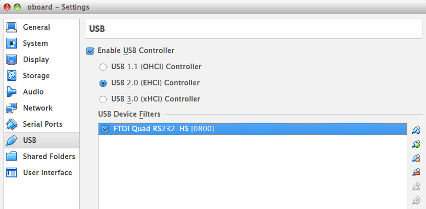
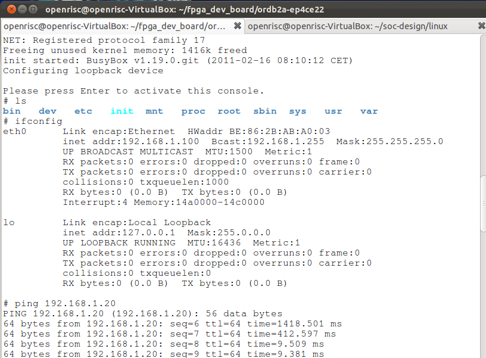

O-board
===
## Introduction




The **O-board** is an Altera FPGA development board and is designed for OpenRISC processor SoC development. This board enables mores hardware and software engineers to easily access to the OpenRISC and gives the designers a quick start on OpenRISC processor system.

To make it easy for the end user, only one USB cable is needed to get started (the top-left USB connector). This USB connector has got a multifunction, it provides the following functions:
* Provides power
* Provides two JTAG interfaces (used for programming the FPGA, external SPI-flash and OpenRISC debugging via GDB)
* Provides two UART interfaces

A VirtualBox Ubuntu image has also been created and has pre-installed all tools which make it VERY easy to get started using this development board. It is delivered with a complete OpenRISC processor SoC reference design that boots Linux 3.1.

## Feature
* ALTERA Cyclone IV E, 22K LUT (P/N: EP4CE22F17C8N)
* SDRAM 32 Mbyte
* SPI FLASH, 1 Mbyte
* SDIO micro connector
* Fast Ethernet
* 1 x micro USB for OTG HOST/SLAVE
* 1x micro USB for power supply, configuration, UARTs
* Expansion connectors
* Supply via USB
* Board size is 96 x 40 mm

---
## Quick Start
The following will introduce how to program O-board as OpenRISC and run Linux.

### 1. Prerequisite
* [VirtualBox](https://www.virtualbox.org/)
* [Oracle VM VirtualBox Extension Pack](http://www.oracle.com/technetwork/server-storage/virtualbox/downloads/index.html#extpack)
* [VirtualBox image file](ftp://openrisc.opencores.org/ )
* [pre-build file](https://s3.amazonaws.com/linksprite/o-board/O_board_prebuild.tar.bz2) including svf and vmlinux

### 2. Install and configure VirtualBox
The purpose with the [VirtualBox Ubuntu image](http://opencores.org/or1k/Ubuntu_VirtualBox-image_updates_and_information) is to make it SUPER easy to get started with the OpenRISC processor system, both with hardware and software. And also to eliminate all installations problems that many interested OpenRISC users are facing.

* Downloand the [VirtualBox](https://www.virtualbox.org/) and install it
* Install [Oracle VM VirtualBox Extension Pack](http://www.oracle.com/technetwork/server-storage/virtualbox/downloads/index.html#extpack) which enable the VirtualBox to connect to these USB devices
* Downloand [VirtualBox image file](ftp://openrisc.opencores.org/)
> The FTP's user name and password are all **openrisc**

### 3. Create a new virtual machine using pre-build image file
* Create a new virtual machine



* Configure the memory size
* Use an existing virtual hard disk file and choose **OpenRISC_Ubuntu_2011-12-15.vdi**   


### 4. Connect the board via USB
* Connect your O-board to your computer using the USB connector(**JP5**) located on the top-left corner on the board
* Set the created **oboard** virtual machine and choose the **FTDI Quad RS232-HS[0800]** USB device.



### 5. Run the virtual machine
* Open a terminal and enter the following commands to download the pre-build files
```
wget https://s3.amazonaws.com/linksprite/o-board/O_board_prebuild.tar.bz2
tar -xvf O_board_prebuild.tar.bz2
cd O_board_prebuild
cp orpsoc_top.svf ~/fpga_dev_board/ordb2a-ep4ce22/
cp vmlinux ~/soc-design/linux/
```

### 6. Configure the FPGA
```
cd ~/fpga_dev_board/ordb2a-ep4ce22
jtag ./program_fpga.jtag
```
> The file "program_fpga.jtag" defines what FPGA programming file that should be used.

The FPGA is now programmed with a pre-compiled OpenRISC processor SOC-design, with the OpenRISC processor, Ethernet, SDHC, UART and SDRAM support. An small boot-loader is stored in the SPI-flash and should now be loaded and executed by the OpenRISC processor.

### 7. Use GDB to download Linux to the SDRAM

There are many ways that we can boot Linux, we can use GDB, we can use orpmon and download it using TFTP, or we can program the SPI-flash. We will using GDB in demo.
* Open up a new terminal tab `shift+ctrl+t` and type:
```
 /opt/or_debug_proxy/bin/or_debug_proxy -r 55555
```
This starts a program (**or_debug_proxy**) that controls the USB connection and communication between the GDB debugger and the OpenRISC processor.

You should see the follwoing print-out:
```
   Connecting to OR1k via USB debug cable(JP7)
   Initialising USB JTAG interface
   JTAG ID = a188a928
   Stalling OR1K CPU0
   Read      npc = 0001727c ppc = 00017278 r1 = 00031774
   Waiting for gdb connection on localhost:55555
   Press CTRL+c to exit.
```

* Open up a new terminal tab `shift+ctrl+t` and type:
```
picocom --b 115200 --p n --d 8 --f xon /dev/ttyUSB2
```
This UART connection will be our Linux-terminal when we boot-up Linux on the OpenRISC SoC-design.

### 8. Boot it on the OpenRISC SoC design
* Open up a new terminal tab `shift+ctrl+t` and type:
```
cd ~/soc-design/linux
or32-elf-gdb
```
* The GDB-debugger is now started and you need to connect it to the or_debug_proxy program, by typing:
```
  (gdb) target remote :55555
```
GDB is now connected to the OpenRISC processor and are now waiting.

* Lets now download the Linux-image, by typing:
```
   (gdb) file ./vmlinux
   Answer "y" on the questions.

   (gdb) load
```
The actual download of the Linux image is now in progress and this takes some time, since the JTAG interface is not the fastest one. The following load information should appear:
>  Loading section .text, size 0x22bd34 lma 0x0  
   Loading section .rodata, size 0x49860 lma 0x22c000  
   Loading section \__param, size 0x1c0 lma 0x275860  
   Loading section .data, size 0x15760 lma 0x276000  
   Loading section \__ex_table, size 0xa50 lma 0x28b760  
   Loading section .head.text, size 0x4000 lma 0x28e000  
   Loading section .init.text, size 0x12348 lma 0x292000  
   Loading section .init.data, size 0x155e54 lma 0x2a4360  
   Start address 0xc0000000, load size 4160160  
   Transfer rate: 86 KB/sec, 4015 bytes/write.  


* Now we want to set the program-counter to start executing from address 0x100, by typing:

```
   (gdb) spr npc 0x100
```
* Now let's boot up Linux on the FPGA development board, by typing:
```
   (gdb) c
```
You should now see Linux booting in the picocom-terminal-window that was opened earlier. And you should get a prompt where you can play around with the Linux port that is running on the OpenRISC processor system.
```
ifconfig
```
You will get the information of eth0 whose IP address is **192.168.1.100**.



You can connect the O-board to your PC directly via Ethernet cable, and set your PC's IP address as **192.168.1.?** which enables them in the same LAN, then you can test your connection by pinging a known IP address.
