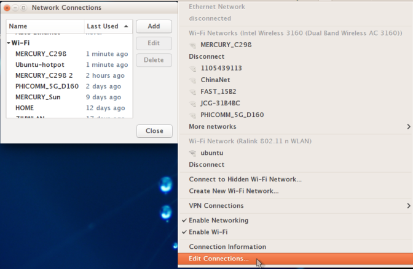
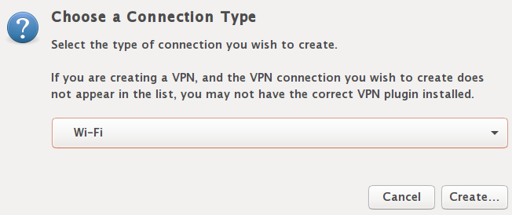
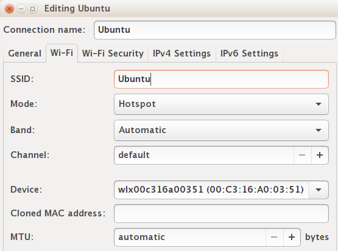
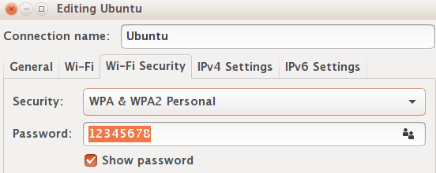
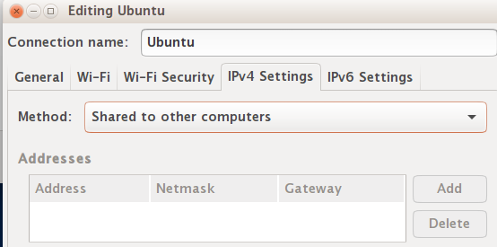
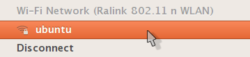
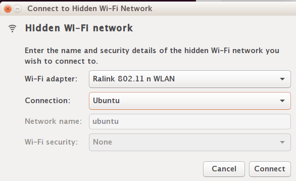

# Create Wifi Hotspot in Ubuntu 16.04 (Android Support)
This post I will show you how to use Unity’s Default Network Manager to create a wireless hotspot with Android devices support.

* Disable WIFI and plug in an internet cable to your laptop so that your Ubuntu is connect to a wired internet and wireless is disabled.

* Go to Network Icon on **top panel -> Edit Connections …**, then click the **Add button** in the pop-up window.

* Choose **Wi-Fi** from the drop-down menu and click the **Create** button:

* In next window, do:

	* Type in a connection name. The name will be used later.
	* Type in a SSID
	* Select mode: Hotspot
	* Device MAC address: select your wireless card from drop-down menu.
create-wifi-hotspot

* Go to Wi-Fi Security tab, select security type WPA & WPA2 Personal and set a password.

* Go to IPv4 Settings tab, from Method drop-down box select **Shared to other computers**.

* When done, click the save button.
* Go to Network Icon again and you will see the created hotspot **ubuntu**

* When everything’s done, enable WIFI from Network Manager icon on the panel. It should automatically connect to the hotspot you created. If not, select **Connect to Hidden Wi-Fi Network …** and select it from the drop-down box. 

Now you can search and connect the access point from your Android mobile and enjoy!
